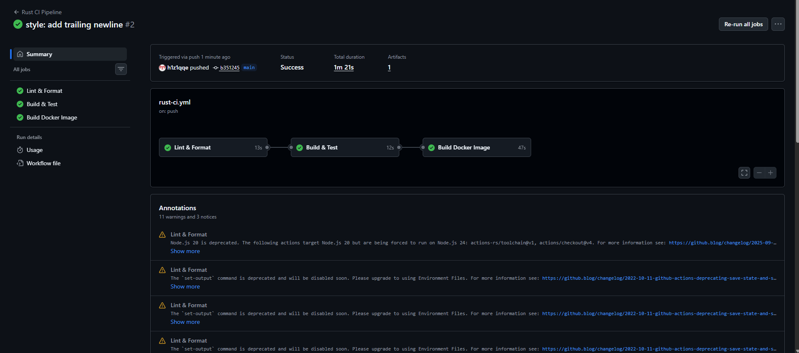
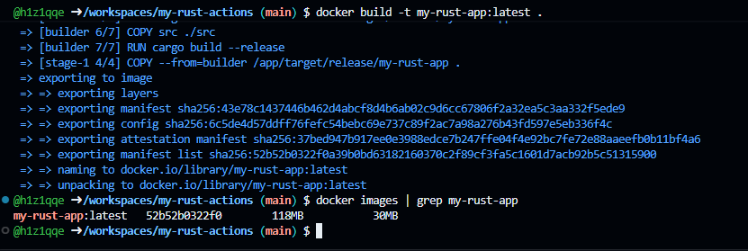
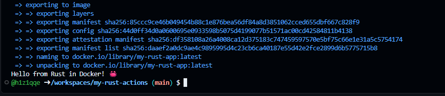

# 🦀 Rust CI Pipeline

### Учебный проект: сборка, тестирование и контейнеризация Rust-приложения в GitHub Actions


**Цель:** освоить настройку CI для Rust, написание эффективных `Dockerfile` (multi-stage) и автоматизацию через GitHub Actions.

## 📋 Структура проекта

```text
my-rust-app/
├── .github/workflows/rust-ci.yml  # Пайплайн CI
├── src/main.rs                    # Исходный код приложения
├── Cargo.toml                     # Конфигурация и зависимости
├── Cargo.lock                     # Фиксация версий (генерируется автоматически)
├── Dockerfile                     # Multi-stage сборка
├── .dockerignore                  # Исключения для Docker
├── .gitignore                     # Исключения для Git
└── README.md                      # Этот файл
```

> 💡 **Быстрый старт:** создайте структуру одной командой:
> ```bash
> mkdir -p .github/workflows src && \
> touch .github/workflows/rust-ci.yml Cargo.toml Cargo.lock .dockerignore .gitignore src/main.rs Dockerfile README.md
>

---

## ⚙️ Конфигурация проекта

### 🔄 GitHub Actions (`.github/workflows/rust-ci.yml`)
Пайплайн проверяет форматирование (`rustfmt`), линтинг (`clippy`), собирает проект (debug/release) и запускает тесты перед сборкой Docker-образа.
<details>
<summary><b>Нажмите, чтобы посмотреть код rust-ci.yml</b></summary>

name: Rust CI Pipeline

on:
  push:
    branches: [ main, master ]
  pull_request:
    branches: [ main, master ]
  workflow_dispatch:

env:
  CARGO_TERM_COLOR: always
  IMAGE_NAME: my-rust-app

jobs:
  lint:
    name: Lint & Format
    runs-on: ubuntu-latest
    steps:
      - uses: actions/checkout@v4
      - uses: actions-rs/toolchain@v1
        with: { profile: minimal, toolchain: stable, components: rustfmt, clippy, override: true }
      - run: cargo fmt --all -- --check
      - run: cargo clippy -- -D warnings

  test:
    name: Build & Test
    runs-on: ubuntu-latest
    needs: lint
    steps:
      - uses: actions/checkout@v4
      - uses: actions-rs/toolchain@v1
        with: { profile: minimal, toolchain: stable, override: true }
      - run: cargo check --verbose
      - run: cargo build --verbose
      - run: cargo build --release --verbose
      - run: cargo test --verbose

  docker-build:
    name: Build Docker Image
    runs-on: ubuntu-latest
    needs: test
    steps:
      - uses: actions/checkout@v4
      - uses: docker/setup-buildx-action@v3
      - uses: docker/build-push-action@v5
        with: { context: ., load: true, tags: ${{ env.IMAGE_NAME }}:latest, cache-from: type=gha, cache-to: type=gha,mode=max }
      - run: |
          docker save ${{ env.IMAGE_NAME }}:latest -o /tmp/docker-image.tar
          gzip /tmp/docker-image.tar
      - uses: actions/upload-artifact@v4
        with: { name: docker-image, path: /tmp/docker-image.tar.gz, retention-days: 7 }
      - run: docker run --rm ${{ env.IMAGE_NAME }}:latest
</details>

### 📦 Rust и Docker
**`Cargo.toml`** (оптимизация для release):
```toml
[package]
name = "my-rust-app"
version = "0.1.0"
edition = "2021"

[profile.release]
lto = true
codegen-units = 1
opt-level = 3
```

**`src/main.rs`**:
```rust
use std::io::{self, Write};

fn main() {
    println!("Hello from Rust in Docker! 🦀");
    io::stdout().flush().unwrap();
    std::thread::sleep(std::time::Duration::from_millis(200));
}
```
> ⚠️ **Важно:** пустая строка в конце файла `main.rs` обязательна для корректной компиляции в некоторых средах. Файл `Cargo.lock` можно оставить пустым, он сгенерируется при первой сборке.

**`Dockerfile`** (Multi-stage):
```dockerfile
# Этап 1: Сборка (кэширование зависимостей)
FROM rust:1-slim AS builder
WORKDIR /app
COPY Cargo.toml Cargo.lock ./
RUN mkdir src && echo "fn main() {}" > src/main.rs
RUN cargo build --release && rm -f target/release/my-rust-app*
COPY src ./src
RUN cargo build --release

# Этап 2: Минимальный образ для запуска
FROM debian:stable-slim
RUN useradd --create-home appuser
WORKDIR /home/appuser
COPY --from=builder /app/target/release/my-rust-app .
USER appuser
CMD ["./my-rust-app"]
```

**`.dockerignore`** и **`.gitignore`**:
```text
# .dockerignore
target/ .git/ .github/ .gitignore .dockerignore *.md *.log Dockerfile

# .gitignore
/target/ **/*.rs.bk *.swp /.idea/ *.iml
```


## 🚀 Этапы выполнения

### 9. Проверка сборки онлайн
1. Закоммитьте и запушьте файлы в ветку `main`.
2. Перейдите на вкладку **Actions** в репозитории GitHub.
3. Дождитесь успешного завершения всех шагов (зелёная галочка ✅).

<div align="center">
  
  <p><em>✅ Workflow успешно выполнен: lint, test и docker-build прошли без ошибок</em></p>
</div>

---

### 10. Проверка сборки Docker-образа локально

Находясь в папке `my-rust-app`, выполните следующие шаги:

**Шаг 1: Сборка образа**
```bash
docker build -t my-rust-app:latest .
```

**Шаг 2: Проверка, что образ создался**
```bash
docker images | grep my-rust-app
```
<div align="center">
  
  <p><em>✅ Образ my-rust-app:latest успешно создан и отображается в списке</em></p>
</div>

**Шаг 3: Запуск контейнера**
```bash
docker run --rm my-rust-app:latest
```
*Ожидаемый вывод: `Hello from Rust in Docker! 🦀`*

**Шаг 4: Вход в контейнер в интерактивном режиме** (для отладки)
```bash
docker run -it --rm --entrypoint /bin/bash my-rust-app:latest
```
<div align="center">
  
  <p><em>✅ Успешный вход в оболочку контейнера (не забудьте ввести <code>exit</code> для выхода)</em></p>
</div>

---

<div align="center">
  <sub>Нашли ошибку или неточность? Сообщите автору! ✉️</sub><br>
  <sub>Сделано с ❤️ и 🦀</sub>
</div>
```

### 💡 Рекомендации перед использованием:
1. Я использовал тег `<details>` для YAML-файла пайплайна. Это **значительно сокращает** длину README, делая его аккуратным, но позволяет заинтересованному читателю развернуть и посмотреть код. Если хотите, чтобы код был виден сразу, просто удалите строки `<details>`, `<summary>...</summary>` и `</details>`.
2. Пути к изображениям оставлены точно такими, как вы указали (`/content/DevOps/CI_CD/img/...`). Если GitHub не будет их отображать, замените начало пути на относительное (например, `img/1.png`), предварительно положив скриншоты в папку `img` внутри репозитория.